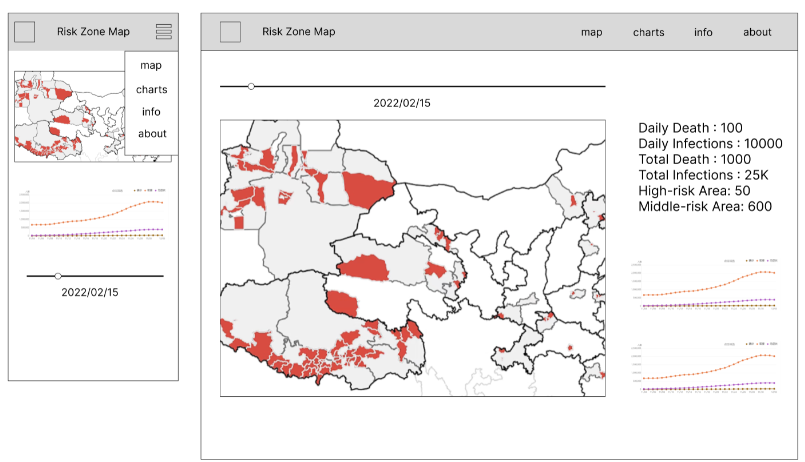
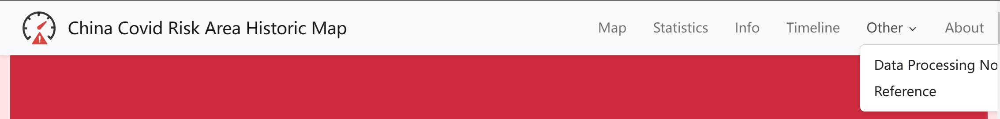
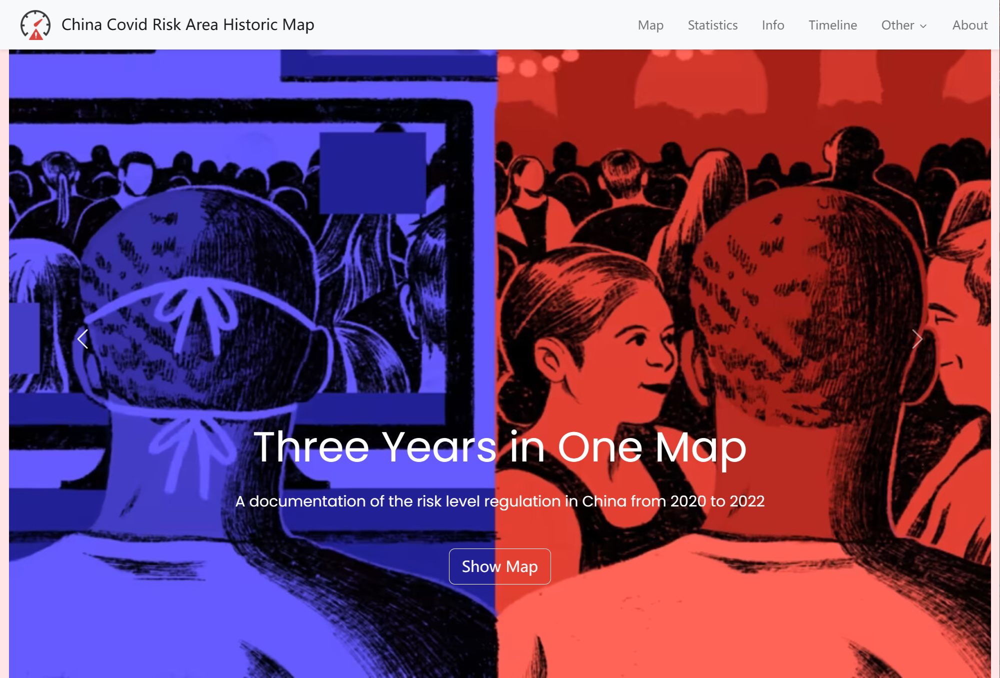
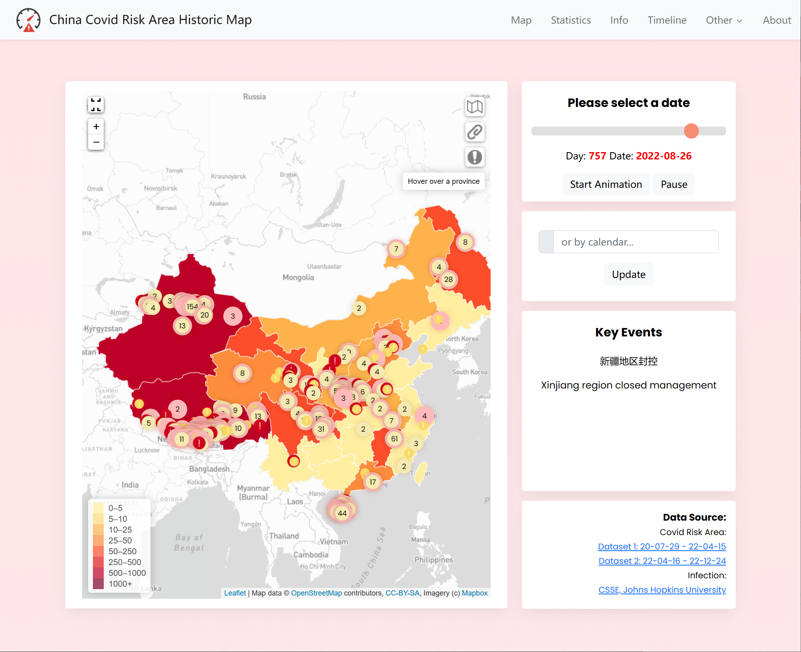
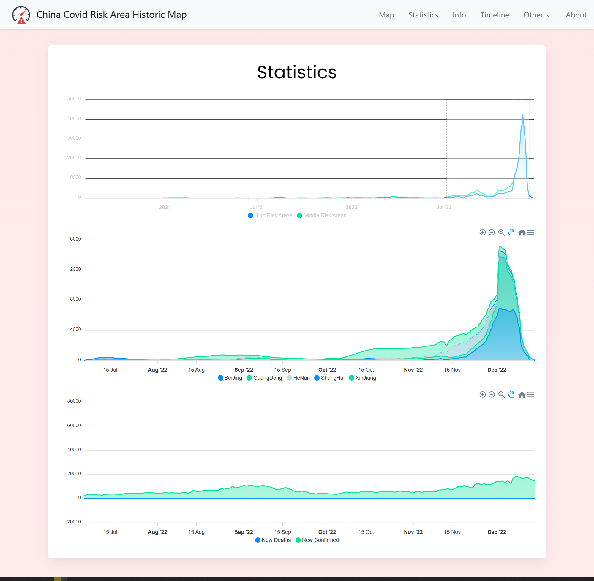
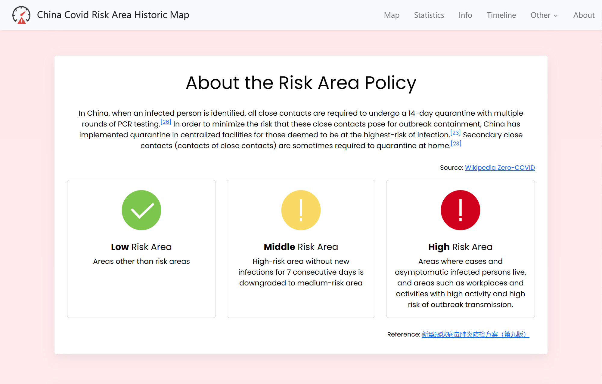
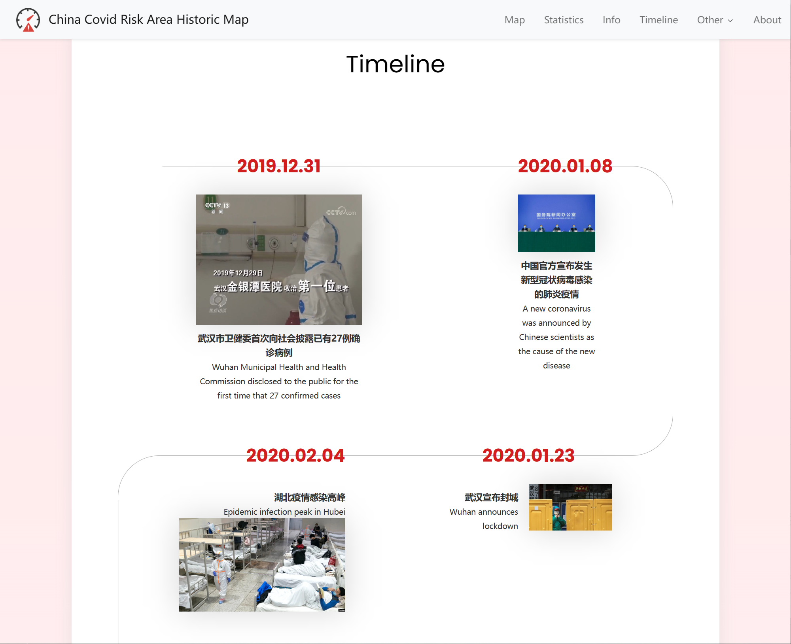

# Readme

# **China Covid Risk Historical Map**

Jin Gao 

2023.01.13

## Project Description

January 8th, 2023 is the date that China officially announces the end of the lockdown policy of COVID-19, which is also the 3-year anniversary of the date when China officially announces the acknowledgment of this new kind of virus. Over the three-year process of dynamic-zero-covid policy implementation, we see the time when the infection had been successfully controlled or beyond the control by the end of 2022. The covid risk control policy plays a vital part in this journey. As a memo, this project records the whole process from the beginning to the end of covid risk level policy.

## **UX/UI**

### UI Mockup



The main theme color for this web page is red, because I want people to recognize the Covid is a severe virus and many people suffered from it. I keep all the information in one page, which makes it easier for people to navigate between sections and make the flow of viewing smooth.

I designed the main feature - map fit one page. When in desktop mode, the controller panels are placed on the right side of the map, making it easier for people to swipe between the dates and learn about the information. 

Each session should be separated with a proper spacing.

The top navigation bar, serves as a guide for the users, should always stays on top for easier navigation. 

The texts should be large and easy to read in both mobile and desktop environment. So I tried to limit the amount of information displayed in one page, carefully aligned them with proper spacing, making it easier to read.

The page should have a branding, which includes a title, an icon and favicon. 

## **FEATURES**

### Navigation Bar




**Functions:** 

1. Site icon and favicon
2. Mobile responsive:  Auto-hide the title and collapse to a hamburger menu button
3. Dropdown menu
4. Click to jump to the related part of the page
5. Always on top of the page

### Header Carousel



**Functions:**

1. Carousel between images
2. Overlay texts with a button
3. Click the “Show Map” button to scroll down to the map section

### Map



**Functions:**

1. A slider bar to select a date and display the date selected
2. Start Animation and Pause button
3. Select the date by using a calendar, the dates available to be selected are restricted to the dates with data
4. Event panel to display the key events corresponding to the current date in both Chinese and English
5. Marker clusters with customized styles and icons
6. Hide and show the markers and the color mapping layers
7. Legends that will be automatically updated when switching to another layer
8. The date slider, events and map are synced. Once the date has been changed, other panels will be live updated.
9. Full Screen and zoom in/out buttons
10. Customized layer controller buttons
11. Map Themes: switch between different map provider


1. Zoom in and click on the risk points to show the address and risk level
    
    
    

### Statistic Charts



**Functions:**

1. Display three types of data in three synchronized charts: the amount of risk areas, the risk areas of key provinces, and the infection cases numbers
2. Brush to specify a range of date
3. Synchronized mouse pop-up panels
4. Lazy load when scrolling to a specific part of the page (here is 500px from the top)

### Info Session



**Functions:**

1. Mobile responsive Bootstrap cards

### Timeline



**Functions:**

1. Mobile responsive layout using CSS media query
2. Display the key events throughout the three-year journey with corresponding pictures
3. Dual language textx

### Data Processing using Node.js

### Risk Area Data Processing

### Step 1: from json to geojson

**Scripts:** 1_generateGeoJSON.js (for dataset 1) ; 2_generateGeoJSON_batch2.js (for dataset 2)

Original JSON Format: 

```jsx
YYMMDD.json

{
"end_update_time" : "YYMMDD"
"hcount":3,
"mcount":7,
"hlist": [
		{
			"province" : "",
			"city" : "",
			"county" : "",
			"communities":[""],
			"locations" : [{lon:00, lat:00},],
			"info":[{},]
},
],
"mlist": [
		{
			"province" : "",
			"city" : "",
			"county" : "", 
			"communities":[""], // the communities is a list of strings with different communities
			"locations" : [{lon:00, lat:00},], // the locations is a list of position objects
			"info":[{},] // the info contains a list of objects corresponding with the communities list
},
],
"success" = 1
```

Result GeoJSON format

```json
YYMMDD_h.geojson
{
    "type": "FeatureCollection",
    "features": [
        {
            "type": "Feature",
            "geometry": {
                "type": "Point",
                "coordinates": []
            },
            "properties": {
                "province": "新疆维吾尔自治区",
                "city": "乌鲁木齐市",
                "county": "天山区",
                "community": "",
                "full_address": "新疆维吾尔自治区乌鲁木齐市天山区",
                "info": ""
            }
        },
...
}
```

### Step 2: Geocoding

**Scripts:** 3_geocodeGeoJSON_APIName.js

This script will fetch the API using the address in the geojson file, get the coordinates, store the raw data into recordRaw.json and generate a dictionary recordDict.json for address-value pairs, to avoid duplicated API calls. 


recordDict.json

```json
{
    "云南省德宏傣族景颇族自治州瑞丽市鑫盛时代佳园小区": [
        97.846372,
        24.004068
    ],
    "内蒙古自治区呼伦贝尔市海拉尔区南区街道": [
        119.812192,
        49.238191
    ],
...
}
```

### Step 3: Add the coordination to the geojson files using recordDict.json

**Scripts:** 4_processGeoJSON.js

### Provincial risk area statistics

**Scripts:** 5_statistics.js, output file: statistics_preprocessed.json

Output how many risk areas in each province per day in the format [timestamp, value], for apexCharts to read.

### Infection Cases Data Processing

**Scripts:** 10_JHDataProcessing

read the csv file cases statistics for each province each day and convert them into json format [timestamp, value]

## **USER STORIES**

A general user who wants to learn about the history of covid risk level policy will first get a impression by the carousel, which displayed several key images showing the effects lockdown has done on people’s mind and body.

The they will be guided to the map page, to leave a first impression on the progresses of the lockdown policy and key events. Along with the charts below to give people a second impression showing the data in a flattened way.

For users who want to know more about the policy, they will then scroll down to the info session, which provides a more detailed description of the policy itself. 

Lastly, users may scroll down to trace the key events happened in the 3-year process by viewing the timeline.

## TECHNOLOGIES USED

1. Bootstrap 5: [https://getbootstrap.com/](https://getbootstrap.com/)
2. Bootstrap 5 Datepicker: *https://www.codehim.com/bootstrap/bootstrap-text-input/bootstrap-5-datepicker-with-vanilla-js/*
3. Leaflet: [https://leafletjs.com/](https://leafletjs.com/)
4. Leaflet Plugins: 
    1. leaflet.fullscreen: [https://github.com/brunob/leaflet.fullscreen](https://github.com/brunob/leaflet.fullscreen)
    2. Leaflet.ChineseTmsProviders: [https://github.com/htoooth/Leaflet.ChineseTmsProviders](https://github.com/htoooth/Leaflet.ChineseTmsProviders)
    3. Leaflet.ActiveLayers: [https://github.com/vogdb/Leaflet.ActiveLayers](https://github.com/vogdb/Leaflet.ActiveLayers)
    4. leaflet.markercluster: [https://github.com/Leaflet/Leaflet.markercluster](https://github.com/Leaflet/Leaflet.markercluster)
5. apexCharts.js: [https://apexcharts.com/](https://apexcharts.com/)
6. Node.js

## TESTING

### TEST CASES
| Test Case # | Test Case Description | Test Steps | Expected Result |
| --- | --- | --- | --- |
| 0 | Prerequisite: The user is at the top of the page | NA | NA |
| 1 | Navbar session | 1) Click each session title 2) Mouse click dropdown menu 3) Shrink the screen size | 1) the page changed to the expected position 2) dropdown menu appears 3) disappear when the screen is below a certain width |
| 2 | Header session | 1) Click the left and right button 2) Click the Show Map button 3) change the screen size | 1) The images changes and has fade effect 2) the page should be at map session 3) the height of the carousel image should fill the whole screen height |
| 3 | Map session | 1) switch on and off different layers 2) click the provinces, and markers 3) click the +/-/full screen button 4) move the handle of the slider 5) click Start Animation button 6) click Pause button 7) select a date by calendar and click Update button 8) make the display smaller | 1) the contents of the map should change accordingly, and when switching between mapping layer, a corresponding legend should appear 2) a popup marker should be displayed 3) zoom in and out and fullscreen 4) the date changes and the map and the events should update accordingly 5) the date should change automatically 6) the date stops changing 7) the map and the slider dates should both updated, as well as the events panel 8) the slider should be moved to the bottom of the map when the screen width is small |
| 4 | Chart session | 1) scroll down the page 2) change the brush region 3) hang mouse over 4) switch on and off labels | 1) the chart should be loaded only when scrolled down below map session 2) the two charts below should be updated accordingly by the updated range of x-axis 3) a pop-up info panel should display 4) the data should show or hide |
| 5 | Info session | 1) change the screen size | 1) the layout should change when the screen becomes larger or smaller |
| 6 | Timeline session | 1) change the screen size | 1) the layout should change when the screen becomes larger or smaller |
|  |  |  |  |

### KNOWN BUGS

1) When click the Start Animation twice in a sequence, the pause button doesn’t function

2) The legend could not be automatically hidden when switch to another mapping layer

3) The full screen button icon is not displayed properly in some screen sizes

4) The risk level data has too many addresses, I haven’t finished geocode them all. So some date, especially after Novemver 2023, is not able to be displayed properly
## DEPLOYMENT

I am hosting my files on [https://www.vpsor.cn/](https://www.vpsor.cn/) web hosting service. This server is linked to my personal domain.

I used FTP to upload the web page and related files into web/covidriskmap. There is no related Database.

## LIVE LINK

[http://gaoj.in/covidriskmap/](http://gaoj.in/covidriskmap/)

## CREDITS AND ACKNOWLEDGMENT

**Code References:**

Timeline: [https://codepen.io/alvarotrigo/pen/MWEgejK](https://codepen.io/alvarotrigo/pen/MWEgejK)

Navbar: https://codepen.io/ceomaverick/pen/PooZevQ

Carousel: [https://getbootstrap.com/docs/5.2/components/carousel/](https://getbootstrap.com/docs/5.2/components/carousel/)

Slider: [https://www.w3schools.com/howto/howto_js_rangeslider.asp](https://www.w3schools.com/howto/howto_js_rangeslider.asp)

Calendar: https://www.codehim.com/bootstrap/bootstrap-text-input/bootstrap-5-datepicker-with-vanilla-js